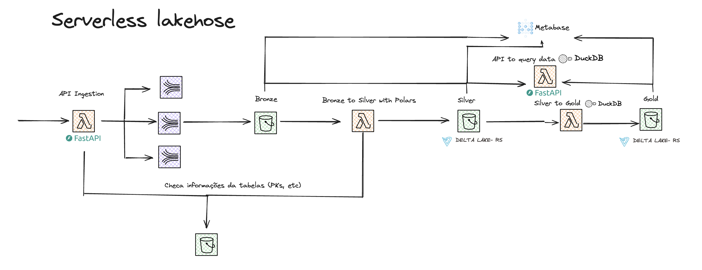

<p align="center">
  
</p>

# Serverless Lakehouse with DuckDB, Polars, and Delta-rs on AWS

This Serverless Lakehouse architecture leverages DuckDB, Polars, Delta-rs, and FastAPI to process data economically and efficiently, without the need for tools like Spark or complex EMR clusters. Using a simple ingestion pipeline through FastAPI and Kinesis Firehose, data is stored in the **bronze layer**, processed in a Lambda function that utilizes DuckDB, Polars, and Delta-rs to perform merges, schema evolution and save it at **silver layers**, and finally transformed into the **gold layer** using EventBridge. The goal of this solution is to build a Lakehouse that eliminates unnecessary costs and complexity, offering a robust and scalable approach for most data processing scenarios.

## Architecture

This solution follows the medallion architecture with three main layers:

* **Bronze**: Raw data is ingested and stored here after being sent through an API built with FastAPI and buffered by Kinesis Firehose. This layer holds the unprocessed data in its original form.
* **Silver**: The data is processed in Lambda using DuckDB, with Polars providing smooth integration between libraries, and Delta-rs handling merges and schema evolution based on primary keys. The processed data is stored in Delta format.
* **Gold**: The final transformation occurs in this layer using EventBridge and DuckDB, providing optimized and cleaned data ready for consumption by analytics tools.

## How to execute this project

Create a virtualenv on MacOS and Linux:

```
$ python3 -m venv .venv
```

After the init process completes and the virtualenv is created, you can use the following
step to activate your virtualenv.

```
$ source .venv/bin/activate
```

If you are a Windows platform, you would activate the virtualenv like this:

```
% .venv\Scripts\activate.bat
```

Once the virtualenv is activated, you can install the required dependencies.

```
$ pip install -r requirements.txt
```

At this point you can now synthesize the CloudFormation template for this code.

```
$ cdk synth
```

To deploy the infrastructure to AWS, run:
```
$ cdk deploy
```

## How the Architecture Works

<p align="center">
  
</p>

* **Ingestion**: Data is ingested via the FastAPI and buffered through Kinesis Firehose.
* **Processing**: Data is processed in AWS Lambda using DuckDB and Polars for efficient data manipulation.
* **Storage**: Delta-rs is used for data merging and schema evolution, ensuring that data remains up-to-date in the silver and gold layers.
* **Transformation**: EventBridge triggers final transformations, storing the refined data in the gold layer for consumption.
* **Consumer API**: Then a API is build, so we can consume this data