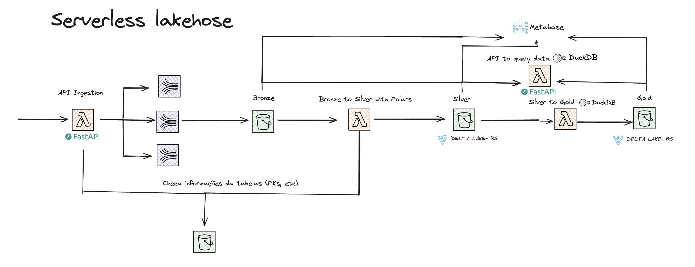

<p align="center">
  
</p>

# Serverless Lakehouse on AWS

A serverless data lakehouse built on AWS using the **medallion architecture** (Bronze → Silver → Gold). The stack replaces heavy tools like Spark and EMR with lightweight, cost-effective alternatives: **DuckDB** for in-Lambda querying, **Polars** for data manipulation, **Apache Iceberg** for table format with schema evolution, and **FastAPI + Mangum** for all API services. The frontend is a React + Vite app with a custom sketchy design system.

For API references, endpoint schemas, and usage examples, see the **[full documentation](https://tadpoledata.com/docs)**.

## Architecture

<p align="center">
  
</p>

Data flows through three layers:

- **Bronze** — Raw records ingested via FastAPI and buffered through Kinesis Firehose into S3, partitioned by domain and table.
- **Silver** — A Lambda triggered on S3 events reads bronze data, applies the schema from the registry, performs upserts/merges, and writes Iceberg tables to the Glue Catalog.
- **Gold** — Transform jobs defined via API run on ECS Fargate (dbt runner) orchestrated by Step Functions, scheduled through EventBridge.

A **Query API** built on DuckDB allows SQL consumption of any layer directly, and a **Schema Registry** manages endpoint definitions (columns, types, primary keys) stored as YAML in S3.

## Deploy

### Prerequisites

- AWS CLI configured (`aws configure`)
- Node.js ≥ 18 and Python ≥ 3.11
- AWS CDK CLI: `npm install -g aws-cdk`
- Docker (required for Docker-based Lambdas)

### Steps

```bash
# 1. Clone and set up a Python virtualenv
python3 -m venv .venv
source .venv/bin/activate        # Windows: .venv\Scripts\activate.bat

# 2. Install dependencies
pip install -r requirements.txt

# 3. Bootstrap CDK (first time only, per AWS account/region)
cdk bootstrap

# 4. Validate the stack
cdk synth

# 5. Deploy
cdk deploy
```

The tenant name used for all AWS resource naming is set via the `"tenant"` key in `cdk.json`.

### Frontend (optional local dev)

```bash
cd frontend
npm install
npm run dev      # dev server
npm run build    # production build
```
